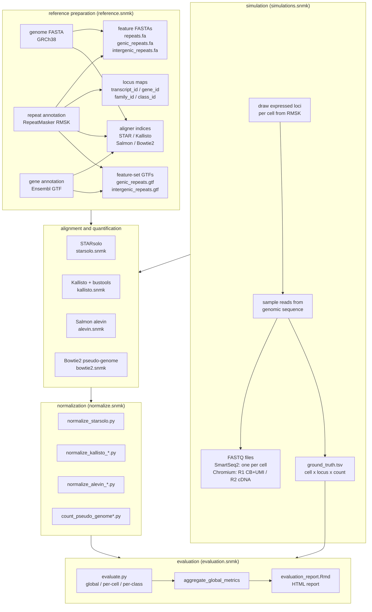
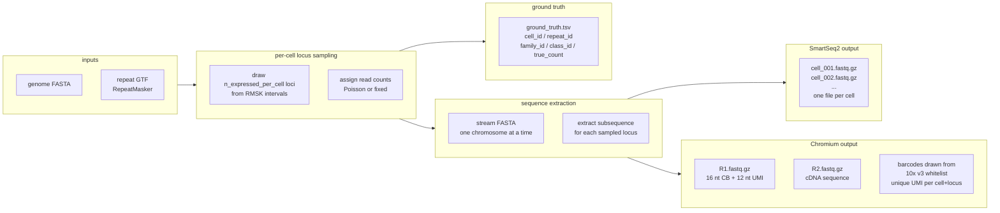
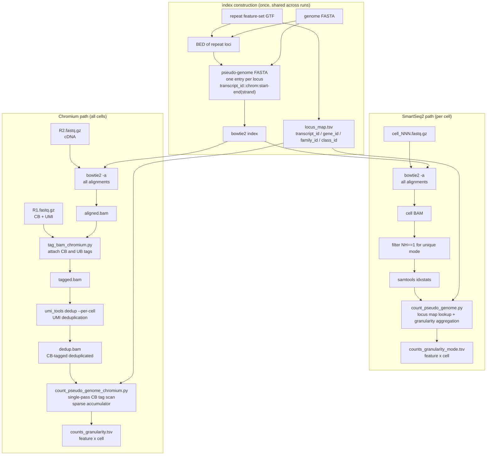
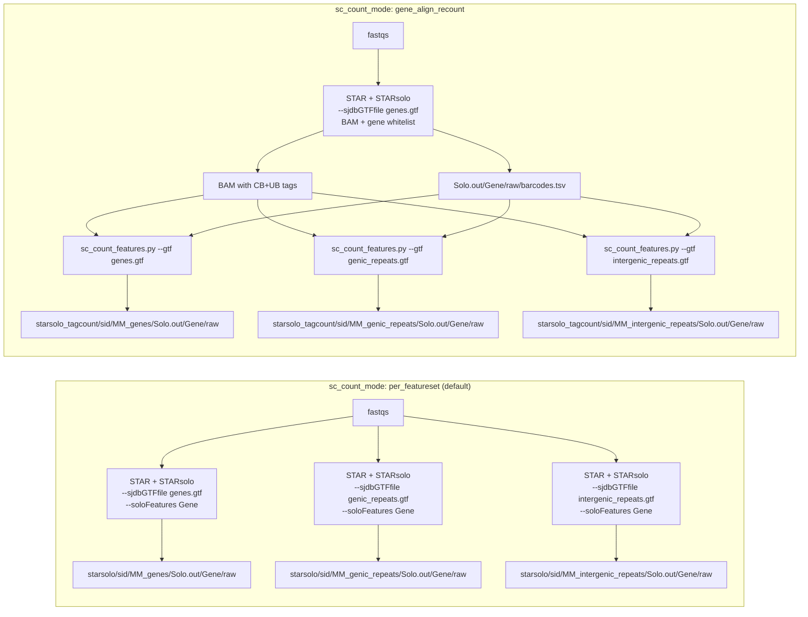
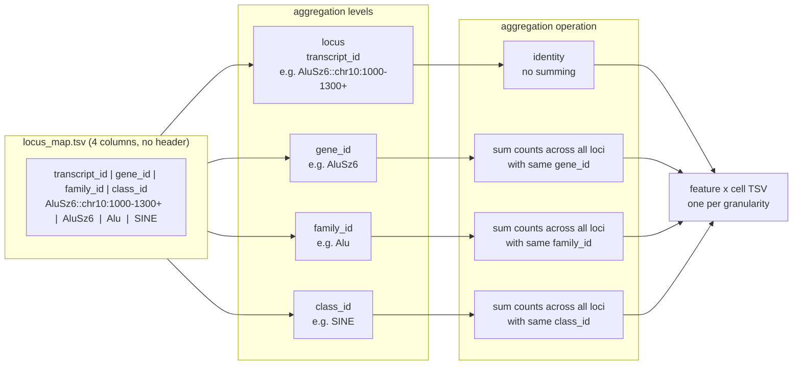
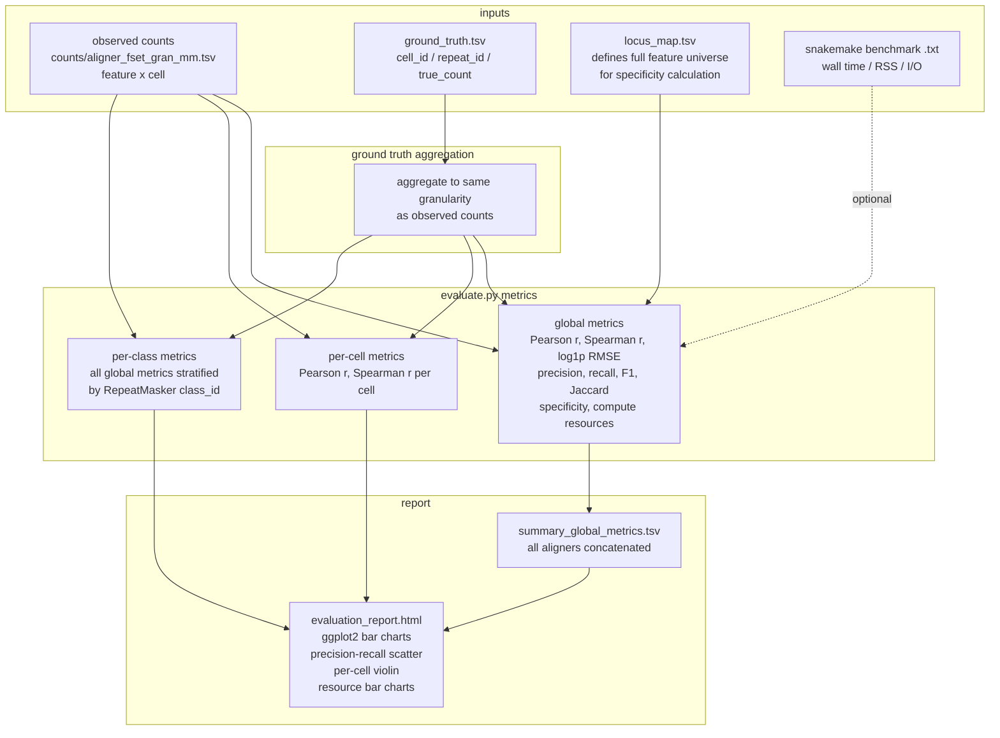

# workflow diagrams

Render to SVG with the mermaid CLI:

```
npm install -g @mermaid-js/mermaid-cli
mmdc -i diagrams.md -o diagrams.svg          # renders first diagram
mmdc -i diagrams.md -o diagrams/ --outputFormat svg  # one SVG per diagram
```

Or paste any block into https://mermaid.live for interactive editing and PNG/SVG export.

---

## overall pipeline



---

## simulation design



---

## bowtie2 pseudo-genome approach



---

## sc STAR counting modes (sc_count_mode)

The sc pipeline supports two STAR-side counting architectures, selectable per yaml via `sc_count_mode`. They write to different output roots so existing analyses are not invalidated when a new run picks the alternate mode.



Trade-offs:

- `per_featureset` is the published baseline. Splice junctions are recomputed per feature_set GTF (a known suboptimality, since repeats should not contribute splice junctions); counting uses STARsolo's native `Gene` semantics including its `EM` multimapper iteration in multi mode.
- `gene_align_recount` aligns once with gene-only splice junctions, then recounts the BAM with `sc_count_features.py`. The recount filters reads to the cell barcodes already whitelisted by STARsolo's gene-counting pass (avoiding the huge unfiltered all-CB matrix), deduplicates UMIs at Hamming-1 (matching STARsolo's `1MM_All` default), and treats multimappers as `1/NH` per locus (a non-iterative approximation of STARsolo's EM, see `docs/methods.md` for the bias direction). Runs `~3x` faster on the alignment phase and indexes at the gene level so reads in introns can also count toward their parent gene.

The two modes are explicitly side-by-side: their outputs live at different paths and downstream consumers can read either by configuration. A comparison Rmd diffs the two count tables in unique mode (where they should agree to the count) and characterises systematic differences in multi mode (where the EM-vs-1/NH bias shows up).

---

## quantification granularity



---

## evaluation design


